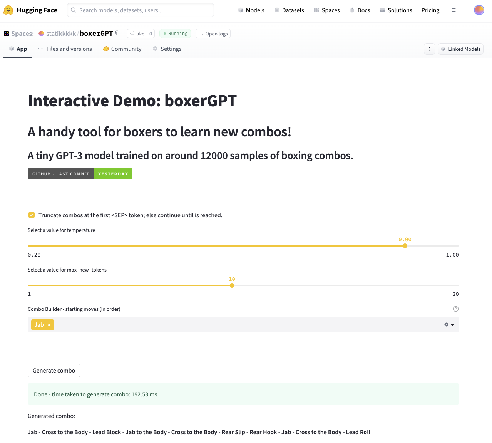
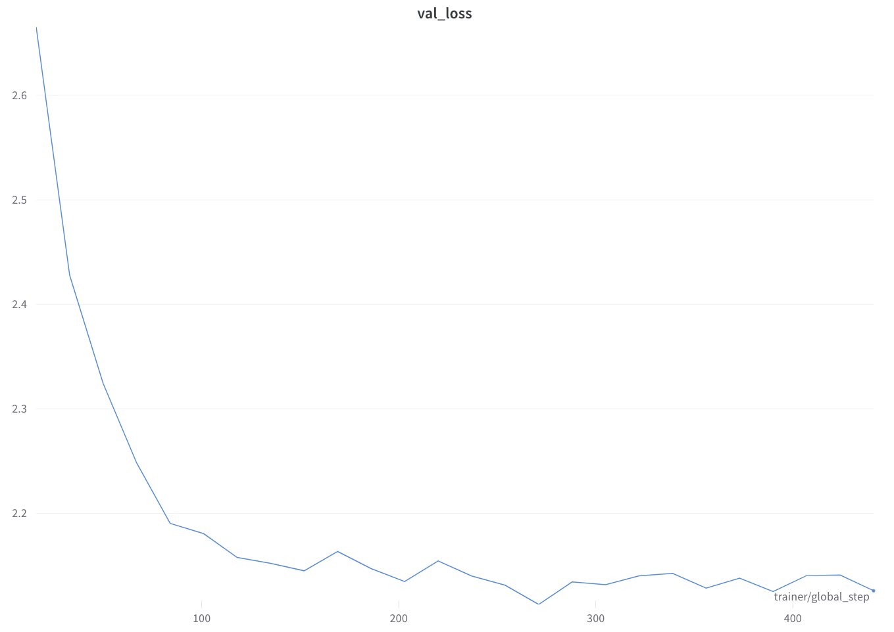

# boxerGPT


[](https://huggingface.co/spaces/statikkkkk/boxerGPT)
[](https://wandb.ai/statikkkkk/boxerGPT/)


📖 Alternative Links for Demos
- [🤗 HF Model](https://huggingface.co/statikkkkk/boxerGPT)
- [🤗 HF Space Demo](https://huggingface.co/spaces/statikkkkk/boxerGPT)
- [Weights and Biases Experiment Tracking](https://wandb.ai/statikkkkk/boxerGPT/)


## Introduction
Are you a boxer? Have you always tried to figure out what to do when you asked to shadowbox? Well, this is the solution for you! This is a tiny GPT-3 model (only 43M parameters) that will generate endless boxing combo and routines for you. 

## Usage
### 🤗 HuggingFace Space
In HF Space, you can see an interactive demo of the model:


### Local Usage
You can also use the model locally. Please head to the [🤗 HF Model](https://huggingface.co/statikkkkk/boxerGPT) page to see the usage of the ONNX checkpoint locally.

## Model Architecture
The model is a tiny GPT-3 model with 6 layers, 6 heads, and 768 hidden size. Due to the limited training data size, larger models performs comparably with the small model. The model is currently trained with the vanilla GPT-3 loss function - `cross_entropy(...)`. 

## Dataset
The model is trained on a dataset of around 12000 boxing combo and routines. The dataset started off from a small dataset of around 20 basic drills, and then augmented with defensive moves. For more information, please visit [README.md](data/README.md) in the `data` folder.

Notably, unlike the original GPT-3 paper, the model is not trained on a large corpus of text, but small sequences of boxing drills. Thus, I have to do a couple of modifications to how the data is processed:
- Unlike traditional text dataset, where one can simply concatenate all the text together for training, the boxing dataset is a list of sequences. This resulted in sequences that are really short, albeit valid boxing combos. To address this, I have to select a very small block size of 3.
- Unlike the original nanoGPT implementation, where it was randomly selecting chunks of text from the dataset using a single random index, I have to iterate through the batch of sequences and generate the random seed individually.

## Training
The model is trained on a single Mac Studio with M1 Max. Unlike the original nanoGPT implementation, I wrapped the GPT model in Pytorch Lightning for easier training. The model is trained for 100 epochs with a batch size of 128 - for more detailed hyperparameters, please visit [W&B - boxerGPT](https://wandb.ai/statikkkkk/boxerGPT/).

## Results
The model eventually converged to a loss of around 2.1:
 

The model is also able to generate valid boxing combos and routines:
```
Jab - Cross to the Body - Jab - Cross - Lead Block - Lead Hook - Drop
Jab - Cross to the Body - Cross - Lead Hook - Rear Hook to the Body
Jab - Drop - Cross to the Body - Drop - Jab - Cross - Rear Slip - Jab to the Body - Lead Slip - Lead Uppercut to the Body
```

## Acknowledgements
This repo is a fork from https://github.com/karpathy/nanoGPT. The GPT model definition is largely reused from the original repo.